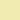

We Build SG branding
===

Logo
---

The logo comes in 2 variations:

1. Circle for normal use
- Square for iOS/Android logo

Font-family is small letter `w` from [Vollkorn bold](https://www.google.com/fonts/specimen/Vollkorn).

Colors
---

-  `#c11a18` Red (primary color) - background
-  `#e06149` Light red - heading
-  `#228dB7` Blue -sub-heading
-  `#f1e9b4` Yellow

Typography
---

- Font-family [Roboto Slab](http://www.google.com/fonts/specimen/Roboto+Slab) for heading
- Font-family [Open San](http://www.google.com/fonts/specimen/Open+Sans) for paragraphs

Writing
---

### Correct

- We Build SG (preferred)
- WeBuild SG
- webuild.sg

### Incorrect

- Webuild SG
- we build sg
- webuild sg

License
---

We Build SG branding is released under the [MIT License](http://opensource.org/licenses/MIT).
